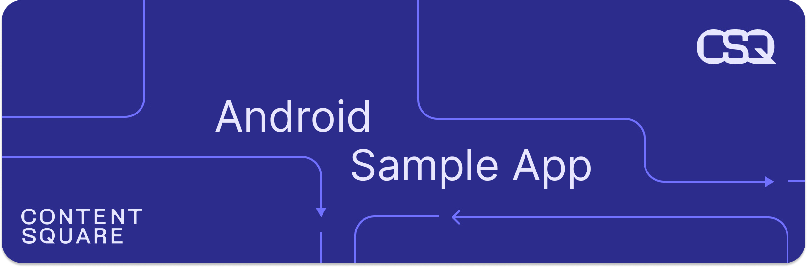

# Android-Sample-app

  

Welcome 🎉 ! This app showcases how to use the Contentsquare SDK in an Android application.

## ⚙️ Get it running

### Prerequisites

You must have Android Studio installed.

### Running the app

* Clone this repo
* You should be able to run the app
* You should see logs from the SDK in the Logcat

## 📚 Docs

If you wish to learn more about the Contentsquare SDK you can find the [documentation](https://docs.contentsquare.com/en/android/).